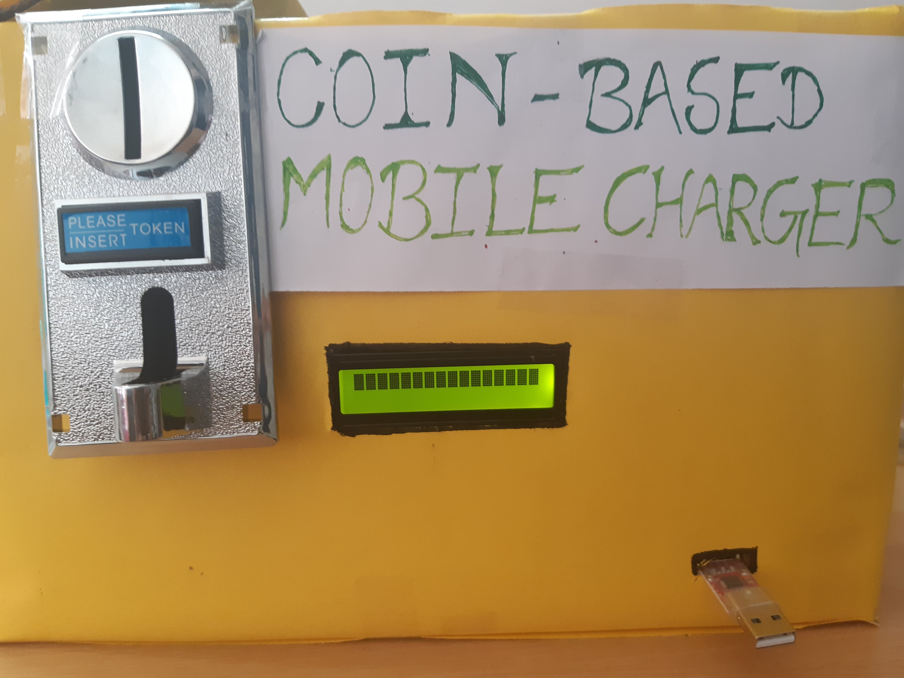
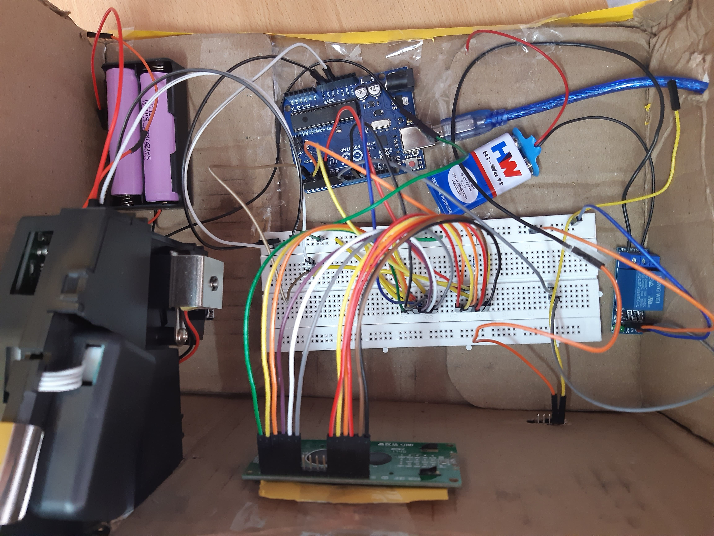

<h1 align="center">COIN BASED MOBILE CHARGER</h1>

The coin based mobile charging system charges the mobile phones when the coin is inserted. The coin acceptor recognizes valid coins and then signals the arduino  for further action. If a valid coin is found, it signals the arduino and then starts the mobile charging mechanism. Below is the image of the final model prepared:

repared:

